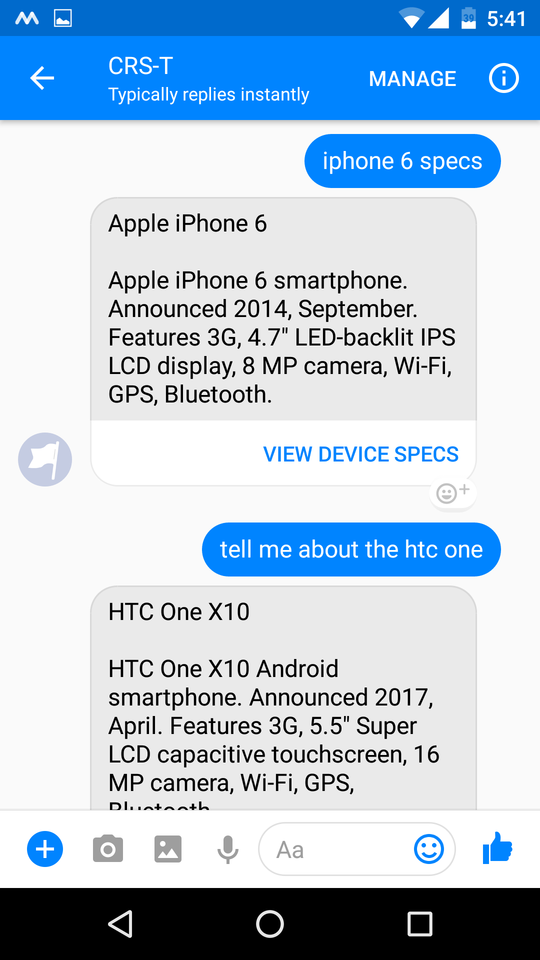

## Conversational Mobile Phone Recommender
A natural language chat bot that recommends mobile phones to users through conversation

This bot currently works on 
- Facebook Messenger
- Kik Messenger
- Telegram Messenger

##### (But it isn't publicly available, so you can't use it just yet.)

Once it's released, if you use any of these messenger services, you can simply start a conversation by searching for it in the messaging platform's store or search feature.

The bot has two main features:

- You can tell the bot (in natural language) what features you're looking for in a mobile phone, and it tries to recommend a suitable device for you.
- You can ask (again, in natural language) for the technical specifications of any mobile phone. 

#### Examples of things you can say:

##### Device Recommendation
- "I want an Android phone with a good camera, at least 3GB of RAM and a fingerprint scanner"
- "Show me some phones made by HTC or Google"
- "I'd like to see some dual SIM phones that also have a good selfie camera."
- ..and so on

##### Requesting Device Specifications
- "What are the specs of the Nexus 5?"
- "Samsung Galaxy S8 specs"
- "Tell me about the OnePlus 5"
- "How's the iPhone 7?"
- ..and so on

You can also scroll through results by saying things like
- "Next result"
- "Next"
- "Previous"
- "Show me another one"
- ..and so on

#### Here are some screenshots:

